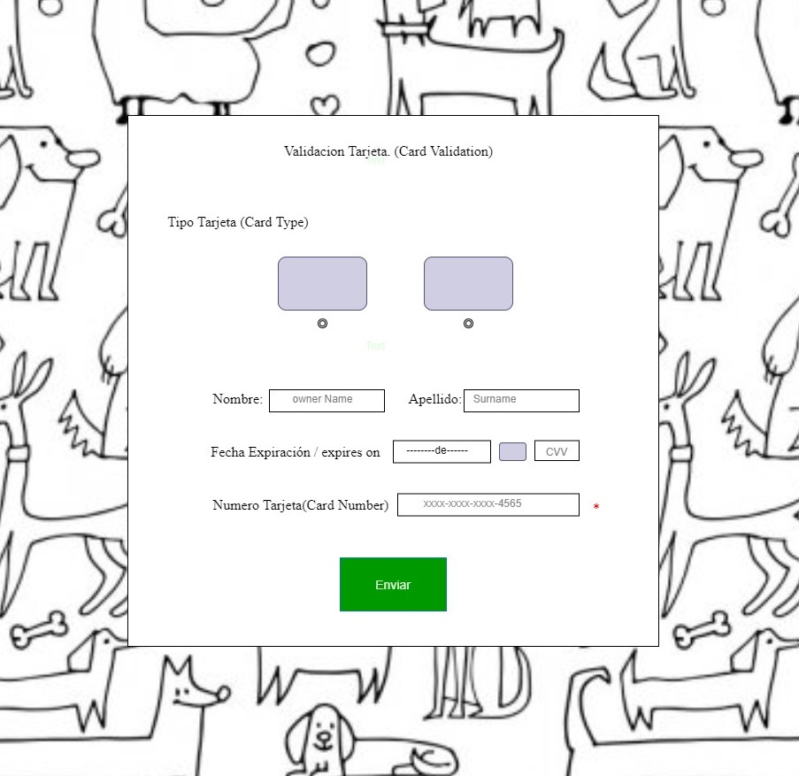

# Card Validator.

Creacion de app web llamada validacion de tarjeta credito para que sea utilizada en tienda dedicada a la venta de insumo de mascotas, esta debe generar confianza y a la vez resguardar la confidencialidad de los datos ingrsados. \_

### Lenguaje utilizado

---

- HTML
- CSS
- JavaScript

### Investigacion UX

\_El usuario corresponde a un emprendimiento que quiere agregar la funcionalidad de pago con tarjeta de credito con la intencion de generar y facilitar la compra de sus productos. Esta funcion debe seguir la linea de la pagina ya desarrolla y a la vez debe lucir confiable y facil de usar ( debe tener indicaciones claras) para que el usuario decida ingresar y validar su tarjeta de credito. Funcion orientada a todas las personas que deseen realizar pago y/o asociar su tarjeta de credito en la tienda virtual.
Inicialmente la pagina solo recibia pagos en efectivo y transferencias a su cuenta personal, lo que a veces hacia decistir de la compra a sus clientes ya que muchos de ellos querian hacer sus pagos con tarjeta de credito. Esta app permitira captar todas aquellas compras que deseen utilizar este medio de pago siendo eficiente para los clientes y el dueño de la tienda.

- -Los clientes podran acceder a comprar con este medio y a la vez tendran la opcion de dejar asociada su tarjeta de compra una vez que esta sea validada de manera facil y eficiente.
- Por otra parte el dueño de la tienda contara con una app que se mostrara confiable para sus clientes y tendra la ventaja y seguridad de que todos los pagos que se realicen seran reales ya que las tarjetas tendran que pasar por el filtro validacion de tarjeta.

### Documentacion inicial de prototipo.

![pro1.

_Creacion de app web llamada validacion de tarjeta credito para que sea utilizada en tienda dedicada a la venta de insumo de mascotas, esta debe generar confianza y a la vez resguardar la confidencialidad de los datos ingrsados. _

### Lenguaje utilizado

---

- HTML
- CSS
- JavaScript

### Investigacion UX

\_El usuario corresponde a un emprendimiento que quiere agregar la funcionalidad de pago con tarjeta de credito con la intencion de generar y facilitar la compra de sus productos. Esta funcion debe seguir la linea de la pagina ya desarrolla y a la vez debe lucir confiable y facil de usar ( debe tener indicaciones claras) para que el usuario decida ingresar y validar su tarjeta de credito. Funcion orientada a todas las personas que deseen realizar pago y/o asociar su tarjeta de credito en la tienda virtual.
Inicialmente la pagina solo recibia pagos en efectivo y transferencias a su cuenta personal, lo que a veces hacia decistir de la compra a sus clientes ya que muchos de ellos querian hacer sus pagos con tarjeta de credito. Esta app permitira captar todas aquellas compras que deseen utilizar este medio de pago siendo eficiente para los clientes y el dueño de la tienda.

- -Los clientes podran acceder a comprar con este medio y a la vez tendran la opcion de dejar asociada su tarjeta de compra una vez que esta sea validada de manera facil y eficiente.
- Por otra parte el dueño de la tienda contara con una app que se mostrara confiable para sus clientes y tendra la ventaja y seguridad de que todos los pagos que se realicen seran reales ya que las tarjetas tendran que pasar por el filtro validacion de tarjeta.

### Documentacion Prototipo Inicial.

#### Resumen Feedback

- Tres de mis compañeras realizaron feedback sobre mi prototipo inicial y todas concidieron en que el esquema era el adecuado y que solo hay que complementarlo con CSS evitando un choque visual y haciendo lucir confiable la app.

##### Documentacion Prototipo Final

###### Objetivos Personales
